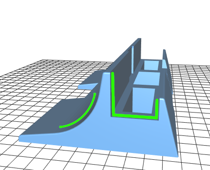

# Mesh Assignment

Toto je další úkol na BI-3DT.

Před odevzdáním úlohy přes GitHub je třeba [projevit souhlas se zpracováním  osobních údajů](https://courses.fit.cvut.cz/BI-3DT/gdpr.html).

Vytvoření repozitáře: https://classroom.github.com/a/Is_S0Qd5

V repozitáři jsou tři nevalidní STL soubory:

 * opravte je v programu netfabb.
 * výsledné objekty musí být v pořádku i z hlediska významu
   * není tedy možné ucpat bez rozmyslu všechny díry apod.

Takhle má vypadat stojan:

 * měl by zůstat zachován prostor na tablet apod. bez umělých diagonálních překážek
 * stojan má být zepředu kulatý (do oblouku) - automatické zavírání děr je třeba nejprve trochu navést manuálně přidanými trojúhelníky
